# ER Diagram — ระบบปักหมุดแจ้งเหตุฉุกเฉิน มข.

> Real-time Emergency Pin-Alert Mobile Application for Khon Kaen University

## ER Diagram (Mermaid)

```mermaid
erDiagram
    %% ==================== USER ENTITIES ====================

    reporters {
        bigint id PK
        varchar email UK "NOT NULL, UNIQUE"
        varchar full_name "NOT NULL"
        varchar phone "NOT NULL"
        varchar password_hash "NOT NULL"
        boolean is_blocked "DEFAULT false"
        timestamp created_at
        timestamp updated_at
    }

    staff {
        bigint id PK
        varchar email UK "NOT NULL, UNIQUE"
        varchar full_name "NOT NULL"
        varchar phone "NOT NULL"
        varchar role "อาสา / เจ้าหน้าที่"
        varchar password_hash "NOT NULL"
        boolean is_blocked "DEFAULT false"
        timestamp created_at
        timestamp updated_at
    }

    admins {
        bigint id PK
        varchar email UK "NOT NULL, UNIQUE"
        varchar full_name "NOT NULL"
        varchar password_hash "NOT NULL"
        timestamp created_at
    }

    %% ==================== TEAM ENTITIES ====================

    teams {
        bigint id PK
        varchar name "NOT NULL"
        varchar status "AVAILABLE / ON_MISSION"
        timestamp created_at
        timestamp updated_at
    }

    team_members {
        bigint id PK
        bigint team_id FK
        bigint staff_id FK
        timestamp joined_at
        timestamp left_at "NULL = ยังอยู่ในทีม"
    }

    %% ==================== INCIDENT ENTITIES ====================

    incident_types {
        bigint id PK
        varchar name "NOT NULL, เช่น อุบัติเหตุ ไฟไหม้"
        int priority_level "1 = สูงสุด"
        boolean is_active "DEFAULT true"
        timestamp created_at
    }

    incidents {
        bigint id PK
        bigint reporter_id FK
        bigint incident_type_id FK
        text description "optional"
        varchar contact_phone "NOT NULL"
        decimal latitude "NOT NULL"
        decimal longitude "NOT NULL"
        varchar status "REPORTED / IN_PROGRESS / NEED_MORE_TEAMS / COMPLETED / CANCELLED"
        int max_teams "DEFAULT 1"
        timestamp created_at
        timestamp updated_at
    }

    incident_assignments {
        bigint id PK
        bigint incident_id FK
        bigint team_id FK
        varchar status "ACCEPTED / COMPLETED / CANCELLED"
        timestamp assigned_at
        timestamp completed_at
    }

    incident_assignment_members {
        bigint id PK
        bigint assignment_id FK
        bigint staff_id FK
        varchar role_at_time "บทบาทตอนนั้น"
        timestamp recorded_at
    }

    incident_evidence {
        bigint id PK
        bigint incident_id FK
        varchar file_type "IMAGE / VIDEO / AUDIO"
        varchar imagekit_file_id "NOT NULL, ImageKit ID"
        varchar file_url "NOT NULL, ImageKit CDN URL"
        varchar file_name "ชื่อไฟล์ต้นฉบับ"
        bigint file_size "bytes"
        timestamp created_at
    }

    %% ==================== CHAT ENTITIES ====================

    chat_messages {
        bigint id PK
        bigint incident_id FK
        varchar sender_type "REPORTER / STAFF"
        bigint sender_id "FK to reporters or staff"
        text message "optional ถ้าส่งแค่ไฟล์"
        timestamp sent_at
    }

    chat_attachments {
        bigint id PK
        bigint message_id FK
        varchar file_type "IMAGE / VIDEO / AUDIO"
        varchar imagekit_file_id "NOT NULL, ImageKit ID"
        varchar file_url "NOT NULL, ImageKit CDN URL"
        varchar file_name "ชื่อไฟล์ต้นฉบับ"
        bigint file_size "bytes"
        timestamp created_at
    }

    %% ==================== HISTORY & REPORT ENTITIES ====================

    block_history {
        bigint id PK
        varchar target_type "REPORTER / STAFF"
        bigint target_id "FK to reporters or staff"
        bigint admin_id FK
        varchar action "BLOCK / UNBLOCK"
        text reason "NOT NULL"
        timestamp created_at
    }

    user_reports {
        bigint id PK
        varchar reporter_type "REPORTER / STAFF"
        bigint reporter_id "คนที่กด report"
        varchar reported_type "REPORTER / STAFF"
        bigint reported_id "คนที่ถูก report"
        bigint incident_id FK "optional, เหตุที่เกี่ยวข้อง"
        text reason "NOT NULL"
        varchar status "PENDING / REVIEWED / DISMISSED"
        text admin_note "optional, admin เขียนสรุป"
        bigint reviewed_by FK "admin ที่ review"
        timestamp created_at
        timestamp reviewed_at
    }

    %% ==================== RELATIONSHIPS ====================

    reporters ||--o{ incidents : "แจ้งเหตุ"
    incident_types ||--o{ incidents : "ประเภทเหตุ"
    incidents ||--o{ incident_assignments : "มอบหมายทีม"
    teams ||--o{ incident_assignments : "รับงาน"
    teams ||--o{ team_members : "สมาชิก"
    staff ||--o{ team_members : "อยู่ในทีม"
    incident_assignments ||--o{ incident_assignment_members : "snapshot สมาชิก"
    staff ||--o{ incident_assignment_members : "ช่วยเหลือจริง"
    incidents ||--o{ incident_evidence : "หลักฐานแจ้งเหตุ"
    incidents ||--o{ chat_messages : "แชทในรายการ"
    chat_messages ||--o{ chat_attachments : "ไฟล์แนบ"
    admins ||--o{ block_history : "ทำการ block/unblock"
    admins ||--o{ user_reports : "review report"
    incidents ||--o{ user_reports : "เหตุที่เกี่ยวข้อง"
```



---

## อธิบาย Entity และ Relationship

### 1. `reporters` — ผู้แจ้งเหตุ (นิสิต / บุคลากรทั่วไป)

- เก็บข้อมูลบัญชี: email, ชื่อ-สกุล, เบอร์โทร, password
- สามารถถูก block ได้โดย admin (ดูประวัติที่ `block_history`)

### 2. `staff` — พนักงาน (อาสา / เจ้าหน้าที่)

- เก็บข้อมูลเหมือน reporter + เพิ่ม `role` (อาสา / เจ้าหน้าที่)
- ทำงานเป็นทีม, ย้ายทีมได้ (ดูประวัติที่ `team_members.left_at`)

### 3. `admins` — ผู้ดูแลระบบ (Dev)

- จัดการประเภทเหตุฉุกเฉิน + เพิ่ม/block ผู้ใช้ + review reports

### 4. `teams` — ทีมพนักงาน

- มีสถานะ: `AVAILABLE` (ว่าง) / `ON_MISSION` (กำลังปฏิบัติงาน)
- 1 ทีม มีสมาชิก (staff) ได้หลายคน

### 5. `team_members` — ตารางเชื่อม Staff ↔ Team (M:N) + ประวัติการย้ายทีม

- `left_at = NULL` → ยังอยู่ในทีมนี้
- `left_at != NULL` → ย้ายออกแล้ว (เก็บเป็นประวัติ)
- เมื่อ staff ย้ายทีม → set `left_at` ของแถวเก่า + สร้างแถวใหม่ในทีมใหม่

### 6. `incident_types` — ประเภทเหตุฉุกเฉิน

- เช่น: อุบัติเหตุ, ไฟไหม้, เจ็บป่วยเฉียบพลัน
- มี `priority_level` กำหนดลำดับความสำคัญ (1 = สำคัญสุด)
- จัดการโดย admin

### 7. `incidents` — รายการแจ้งเหตุ

- เชื่อมกับ reporter (คนแจ้ง) และ incident_type (ประเภท)
- เก็บพิกัด GPS (latitude, longitude) สำหรับปักหมุด
- เก็บเบอร์ติดต่อ (กรอกเองหรือดึงจากบัญชี)
- `max_teams`: จำนวนทีมที่รับได้ (default 1, เพิ่มได้เมื่อกดขอทีมเพิ่ม)
- **สถานะ:**
  - `REPORTED` → พึ่งแจ้ง, รอทีมรับ
  - `IN_PROGRESS` → มีทีมรับงานแล้ว
  - `NEED_MORE_TEAMS` → ต้องการทีมเพิ่ม
  - `COMPLETED` → ช่วยเหลือสำเร็จ
  - `CANCELLED` → ยกเลิก

### 7.1 `incident_evidence` — หลักฐานประกอบการแจ้งเหตุ

- ผู้แจ้งเหตุแนบหลักฐานได้ตอนสร้างรายการ (รูปภาพ / วิดีโอ / เสียง)
- 1 รายการแจ้งเหตุ แนบหลักฐานได้หลายไฟล์
- เก็บ `imagekit_file_id` สำหรับจัดการไฟล์บน ImageKit (ลบ/แก้ไข)
- เก็บ `file_url` เป็น CDN URL สำหรับแสดงผลฝั่ง client

### 8. `incident_assignments` — มอบหมายทีม ↔ รายการแจ้งเหตุ (M:N)

- 1 รายการแจ้งเหตุมีหลายทีมช่วยได้
- 1 ทีมรับหลายรายการได้ (ถ้าว่าง)
- **สถานะ:**
  - `ACCEPTED` → ทีมรับงาน
  - `COMPLETED` → ทีมทำเสร็จ
  - `CANCELLED` → ทีมยกเลิก

### 9. `incident_assignment_members` — 📸 snapshot สมาชิกที่ช่วยเหลือจริง

- เมื่อทีมกดรับงาน → ระบบ snapshot สมาชิกทุกคนในทีมตอนนั้นลงตารางนี้
- แก้ปัญหา: ถ้า staff ย้ายทีมทีหลัง ก็ยังดูย้อนหลังได้ว่าตอนนั้นใครช่วยบ้าง
- เก็บ `role_at_time` เพราะ staff อาจเปลี่ยน role ในอนาคต

### 10. `chat_messages` — ข้อความแชท

- 1 รายการแจ้งเหตุ = 1 ห้องแชท
- ผู้ส่งเป็นได้ทั้ง `REPORTER` หรือ `STAFF` (ใช้ `sender_type` + `sender_id` แยก)
- รองรับหลายคน: ทุก staff ในทุกทีมที่รับงาน + ผู้แจ้งเหตุ สามารถส่งข้อความได้
- `message` เป็น optional (กรณีส่งแค่รูป/วิดีโอ)

### 11. `chat_attachments` — ไฟล์แนบในแชท (รูปภาพ / วิดีโอ / เสียง)

- 1 ข้อความแนบไฟล์ได้หลายไฟล์
- เก็บ `file_type` (IMAGE / VIDEO / AUDIO)
- เก็บ `imagekit_file_id` สำหรับจัดการไฟล์บน ImageKit (ลบ/แก้ไข)
- เก็บ `file_url` เป็น CDN URL สำหรับแสดงผลฝั่ง client

### 12. `block_history` — ประวัติการ block/unblock

- เก็บทุกครั้งที่ admin ทำการ block หรือ unblock
- `target_type`: ระบุว่า block ใคร (REPORTER / STAFF)
- `reason`: เหตุผลที่ block/unblock (บังคับกรอก)

### 13. `user_reports` — ระบบรายงานผู้ใช้

- Staff report Reporter (เช่น แจ้งเหตุมัว)
- Reporter report Staff (เช่น พฤติกรรมไม่เหมาะสม)
- Staff report Staff ก็ได้
- เชื่อมกับ `incident_id` (optional) เพื่อระบุเหตุที่เกี่ยวข้อง
- **สถานะ:**
  - `PENDING` → รอ admin review
  - `REVIEWED` → admin ดูแล้ว (อาจนำไปสู่การ block)
  - `DISMISSED` → admin ปัดตก
- `admin_note`: admin เขียนสรุปผลการ review

---

## สรุป Relationships

| Relationship                                           | Type             | คำอธิบาย                               |
| ------------------------------------------------------ | ---------------- | -------------------------------------- |
| `reporters` → `incidents`                              | **One-to-Many**  | 1 ผู้แจ้ง สร้างได้หลายรายการ           |
| `incident_types` → `incidents`                         | **One-to-Many**  | 1 ประเภท ใช้ได้หลายรายการ              |
| `staff` ↔ `teams`                                      | **Many-to-Many** | ผ่าน `team_members` (มีประวัติย้ายทีม) |
| `incidents` ↔ `teams`                                  | **Many-to-Many** | ผ่าน `incident_assignments`            |
| `incident_assignments` → `incident_assignment_members` | **One-to-Many**  | snapshot สมาชิกที่ช่วยจริง             |
| `staff` → `incident_assignment_members`                | **One-to-Many**  | staff คนเดียวช่วยหลายงาน               |
| `incidents` → `incident_evidence`                      | **One-to-Many**  | 1 รายการ แนบหลักฐานได้หลายไฟล์         |
| `incidents` → `chat_messages`                          | **One-to-Many**  | 1 รายการ = 1 ห้องแชท                   |
| `chat_messages` → `chat_attachments`                   | **One-to-Many**  | 1 ข้อความ แนบได้หลายไฟล์               |
| `admins` → `block_history`                             | **One-to-Many**  | admin ทำ block/unblock                 |
| `admins` → `user_reports`                              | **One-to-Many**  | admin review reports                   |
| `incidents` → `user_reports`                           | **One-to-Many**  | report เชื่อมกับเหตุที่เกี่ยวข้อง      |

---

## แนะนำ Indexes

```sql
-- ค้นหารายการแจ้งเหตุที่ยังไม่เสร็จ เรียงตามความสำคัญ
CREATE INDEX idx_incidents_status ON incidents(status);
CREATE INDEX idx_incident_types_priority ON incident_types(priority_level);

-- ค้นหา assignment ตาม incident หรือ team
CREATE INDEX idx_assignments_incident ON incident_assignments(incident_id);
CREATE INDEX idx_assignments_team ON incident_assignments(team_id);

-- ค้นหาสมาชิกที่ช่วยเหลือจริง
CREATE INDEX idx_assignment_members_assignment ON incident_assignment_members(assignment_id);
CREATE INDEX idx_assignment_members_staff ON incident_assignment_members(staff_id);

-- ค้นหาข้อความแชทตามรายการแจ้งเหตุ
CREATE INDEX idx_chat_incident ON chat_messages(incident_id, sent_at);

-- ค้นหาหลักฐานตามรายการแจ้งเหตุ
CREATE INDEX idx_evidence_incident ON incident_evidence(incident_id);

-- ค้นหาสมาชิกในทีม (เฉพาะคนที่ยังอยู่)
CREATE INDEX idx_team_members_active ON team_members(team_id) WHERE left_at IS NULL;
CREATE INDEX idx_team_members_staff ON team_members(staff_id);

-- ค้นหาประวัติ block
CREATE INDEX idx_block_history_target ON block_history(target_type, target_id);

-- ค้นหา reports ที่รอ review
CREATE INDEX idx_user_reports_status ON user_reports(status);
CREATE INDEX idx_user_reports_reported ON user_reports(reported_type, reported_id);
```
