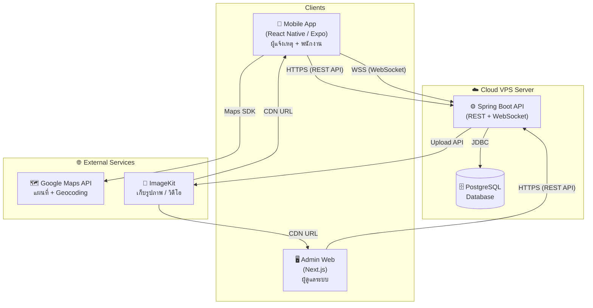
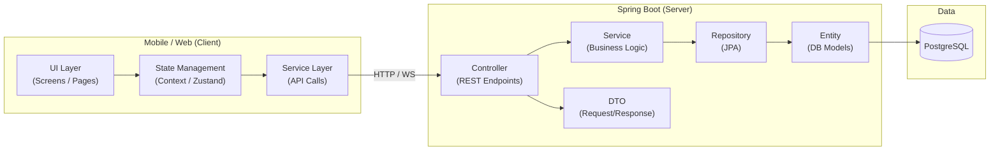
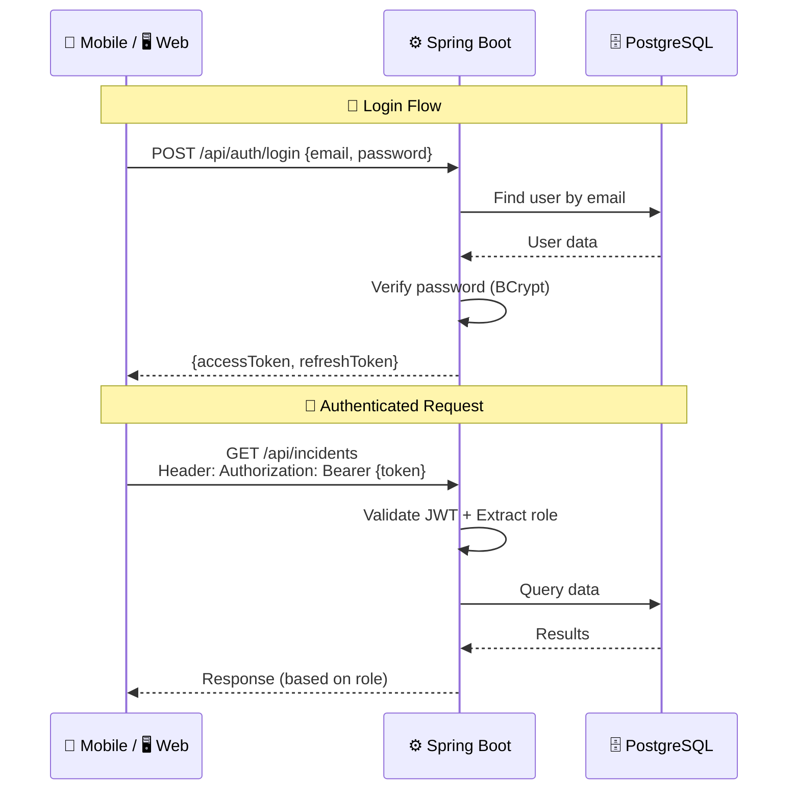
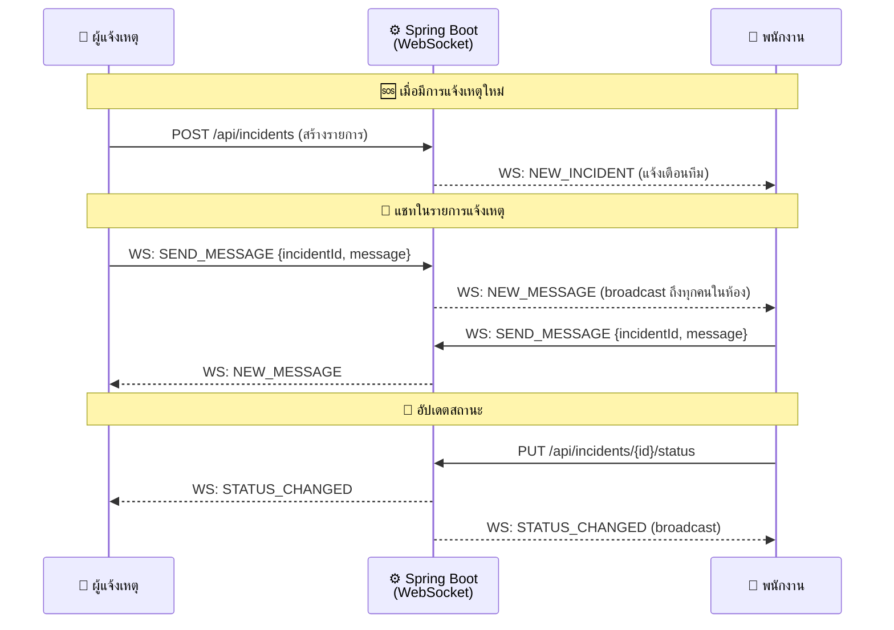
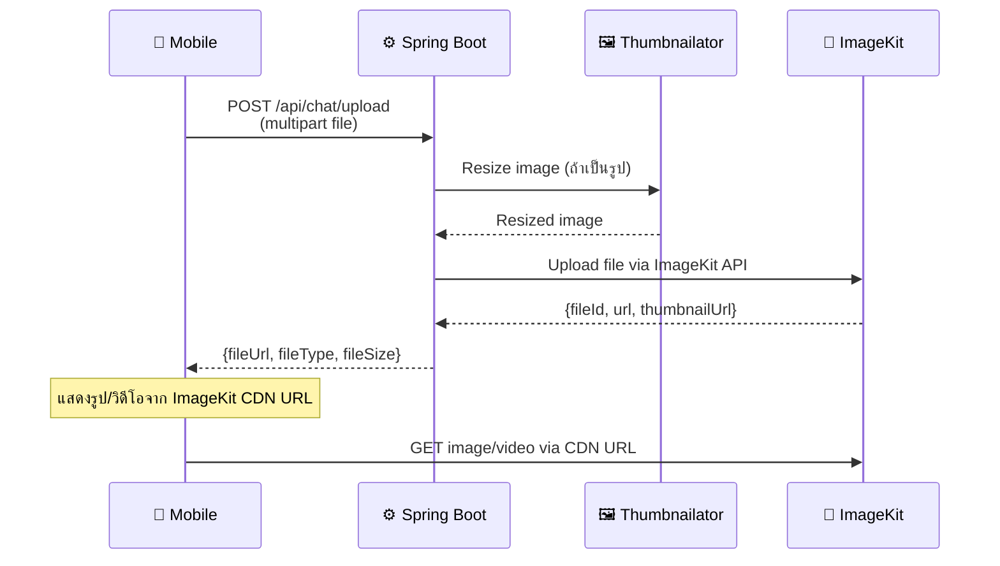
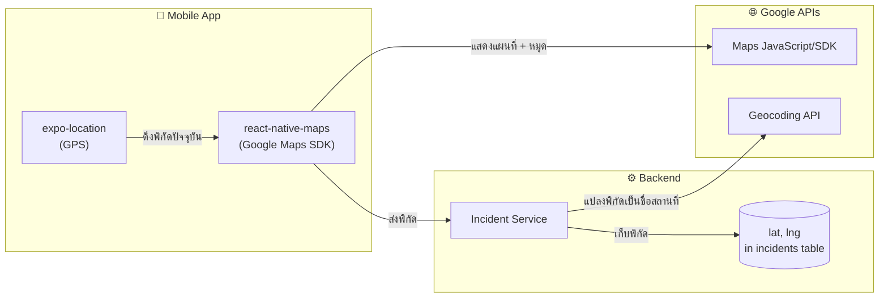
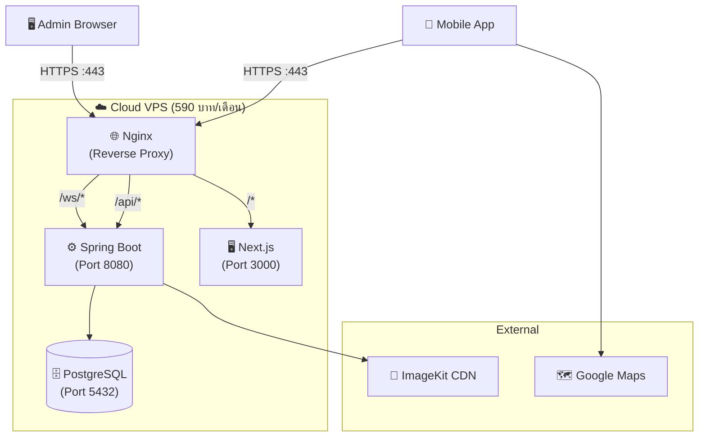

# System Architecture — ระบบปักหมุดแจ้งเหตุฉุกเฉิน มข.

> Real-time Emergency Pin-Alert Mobile Application for Khon Kaen University

---

## 1. High-Level Architecture



---

## 2. Tech Stack Summary

| Layer                 | Technology               | Version | หน้าที่                        |
| --------------------- | ------------------------ | ------- | ------------------------------ |
| **Mobile**            | React Native (Expo)      | SDK 55  | แอปผู้แจ้งเหตุ + พนักงาน       |
| **Mobile UI**         | NativeWind (TailwindCSS) | v4      | Styling                        |
| **Mobile Navigation** | Expo Router              | v55     | File-based routing             |
| **Admin Web**         | Next.js                  | v15     | Admin Dashboard                |
| **Web UI**            | Tailwind CSS             | v4      | Styling                        |
| **Backend**           | Spring Boot              | v3.5.11 | REST API + WebSocket Server    |
| **Language**          | Java                     | v21     | Backend language               |
| **Database**          | PostgreSQL               | latest  | ข้อมูลหลัก                     |
| **ORM**               | Spring Data JPA          | —       | Database access                |
| **Auth**              | JWT (jjwt)               | v0.12.3 | Authentication / Authorization |
| **API Docs**          | Swagger (springdoc)      | v2.8.13 | API Documentation              |
| **Maps**              | Google Maps API          | —       | แผนที่ + ปักหมุด + Geocoding   |
| **Media Storage**     | ImageKit                 | —       | เก็บรูปภาพ / วิดีโอ (CDN)      |
| **Utilities**         | Lombok                   | —       | Auto getter/setter             |
| **Image Processing**  | Thumbnailator            | v0.4.20 | Resize รูปก่อน upload          |

---

## 3. Architecture Pattern



### Backend Layer Pattern (Spring Boot)

| Layer          | Package       | หน้าที่                                               |
| -------------- | ------------- | ----------------------------------------------------- |
| **Controller** | `controller/` | รับ HTTP Request, validate input, ส่งต่อ Service      |
| **DTO**        | `dto/`        | กำหนดรูปแบบ Request/Response (ไม่เปิดเผย Entity ตรงๆ) |
| **Service**    | `service/`    | Business Logic ทั้งหมด                                |
| **Repository** | `repository/` | Query ฐานข้อมูล (Spring Data JPA)                     |
| **Entity**     | `entity/`     | Java class ที่ map กับ table ใน DB                    |
| **Config**     | `config/`     | Security, WebSocket, CORS, ImageKit config            |
| **Exception**  | `exception/`  | Custom error handling                                 |

---

## 4. Authentication & Authorization Flow



### Role-Based Access

| Endpoint กลุ่ม                             | REPORTER | STAFF  | ADMIN  |
| ------------------------------------------ | :------: | :----: | :----: |
| `POST /api/incidents` (แจ้งเหตุ)           |    ✅    |   ❌   |   ❌   |
| `GET /api/incidents` (ดูรายการ)            |  ✅ own  | ✅ all | ✅ all |
| `POST /api/incidents/{id}/accept` (รับงาน) |    ❌    |   ✅   |   ❌   |
| `GET /api/teams` (จัดการทีม)               |    ❌    |   ✅   |   ✅   |
| `POST /api/reports` (report ผู้ใช้)        |    ✅    |   ✅   |   ❌   |
| `PUT /api/admin/users/{id}/block`          |    ❌    |   ❌   |   ✅   |
| `CRUD /api/admin/incident-types`           |    ❌    |   ❌   |   ✅   |

---

## 5. Real-time Communication (WebSocket)



### WebSocket ใช้ในกรณี:

1. **แจ้งเตือนเหตุใหม่** → ส่งไปทุกพนักงานที่ online
2. **แชท** → broadcast ข้อความในห้องแชทของรายการนั้น
3. **อัปเดตสถานะ** → แจ้งทุกฝ่ายเมื่อสถานะเปลี่ยน
4. **ขอทีมเพิ่ม** → แจ้งเตือนทีมอื่นว่ามีงานต้อง support

---

## 6. Media Upload Flow (ImageKit)



### ทำไมใช้ ImageKit?

- **CDN** — โหลดเร็วทั่วโลก
- **Image Transformation** — resize, crop on-the-fly ผ่าน URL params
- **Free tier** — 20GB bandwidth/เดือน (เพียงพอสำหรับโปรเจคจบ)
- **ไม่ต้องเก็บไฟล์ใน server** — ประหยัดพื้นที่ VPS

---

## 7. Google Maps Integration



### Google Maps ใช้ในกรณี:

1. **ปักหมุดตำแหน่งเหตุฉุกเฉิน** — ผู้แจ้งเหตุกดปักหมุด ส่ง lat/lng
2. **แสดงตำแหน่งเหตุบนแผนที่** — พนักงานเห็นหมุดเหตุทั้งหมด
3. **Geocoding** — แปลง lat/lng เป็นชื่อสถานที่ (เช่น "ตึก EN06 มข.")
4. **Direction** — (อนาคต) นำทางไปยังจุดเกิดเหตุ

---

## 8. Deployment Architecture



### Deployment Stack:

| Component       | ทำงานบน                                                                   |
| --------------- | ------------------------------------------------------------------------- |
| **Nginx**       | Reverse proxy, SSL termination, route `/api` → Spring Boot, `/` → Next.js |
| **Spring Boot** | Run as JAR (port 8080)                                                    |
| **Next.js**     | `npm run start` (port 3000)                                               |
| **PostgreSQL**  | ติดตั้งบน VPS เดียวกัน                                                    |
| **ImageKit**    | External CDN (ไม่ต้อง host เอง)                                           |
| **Google Maps** | External API (ใช้ผ่าน SDK ฝั่ง client)                                    |

---

## 9. Project Structure

```
FinalYearProject/
├── 📂 backend/                        (Spring Boot API)
│   └── src/main/java/com/kku/emergency_alert_api/
│       ├── config/                    Security, WebSocket, CORS, ImageKit
│       ├── controller/                REST API endpoints
│       ├── dto/                       Request / Response objects
│       ├── entity/                    JPA Entities (ตาม ER Diagram)
│       ├── exception/                 Custom exceptions
│       ├── repository/                JPA Repositories
│       ├── service/                   Business logic
│       └── util/                      JWT, file helpers
│
├── 📂 mobile/                         (React Native / Expo)
│   ├── app/                           Screens (file-based routing)
│   │   ├── (auth)/                    Login, Register
│   │   ├── (reporter)/                หน้าจอผู้แจ้งเหตุ
│   │   └── (staff)/                   หน้าจอพนักงาน
│   ├── components/                    Reusable UI components
│   ├── services/                      API calls + WebSocket
│   ├── hooks/                         Custom hooks
│   ├── context/                       Auth context, Socket context
│   ├── constants/                     Colors, API URLs
│   └── utils/                         Helpers
│
├── 📂 web/                            (Next.js Admin)
│   └── src/app/
│       ├── dashboard/                 Overview + statistics
│       ├── incidents/                 จัดการรายการแจ้งเหตุ
│       ├── users/                     จัดการ reporters + staff
│       ├── incident-types/            จัดการประเภทเหตุ
│       └── reports/                   Review user reports
│
└── 📂 docs/                           Documentation
    ├── er-diagram.md
    └── system-architecture.md
```
